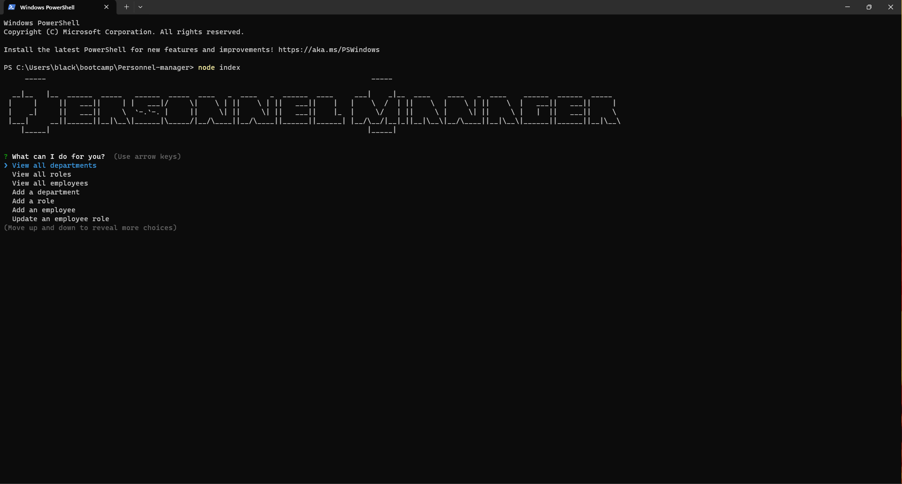
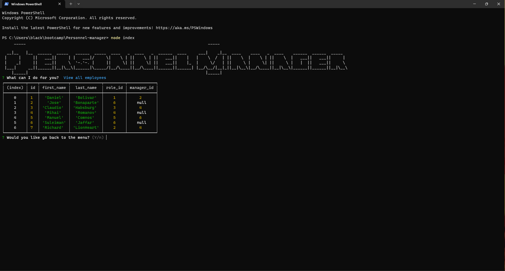
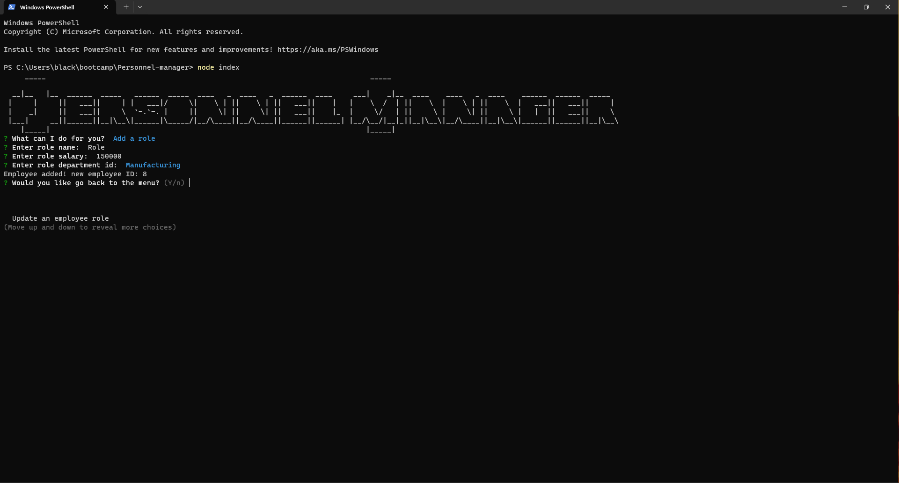
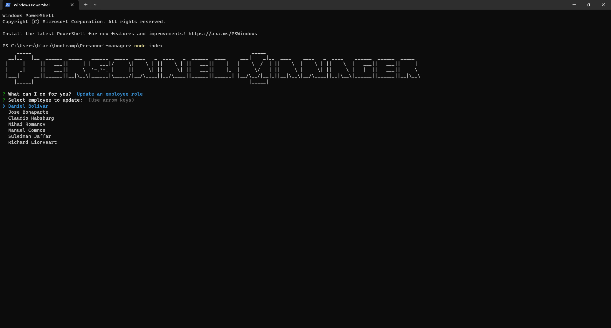
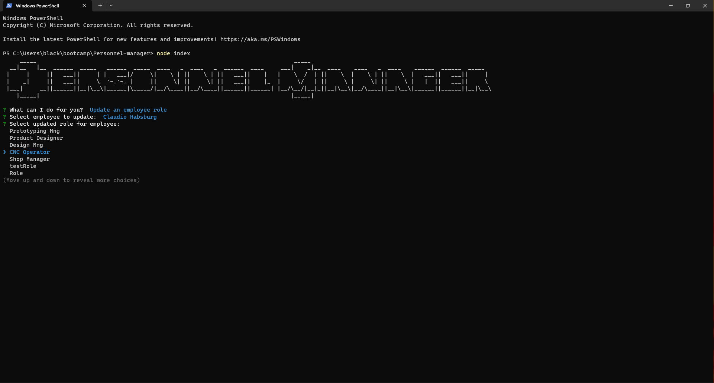

# Personnel Manager

## Description

To test my mySQL and OOP knowledge I build this personnel manager, it allows you to manage all the info pertaining to your business structure like departments, roles, and employees and all their related information, you can view all your employees, roles and department as well as add new ones or updated employee information

## Table of Contents+

- [Installation](#installation)
- [Usage](#usage)
- [Questions](#questions)
- [Credits](#credits)
- [Walkthrough] (#walkthrough)

## Installation

The npm i command will take care of any necessary installations

## Usage
Upon start you'll find the app menu

When you select a view option, it shows a table with all the information regarding the departments, roles or employees of the company

When you select an ADD option, it will ask you a few questions before adding it to the database

Finally if you select UPDATE you can select the employee to be updated

And then the role to update to

## Tests

No tests provided

## Questions

For questions contact me at [Github](https://github.com/venecoderr) or [Email me](mailto:josefrm.55@gmail.com)

## Walkthrough

https://app.screencastify.com/v3/watch/yPmoVLu3XhtUP2ZTBBta